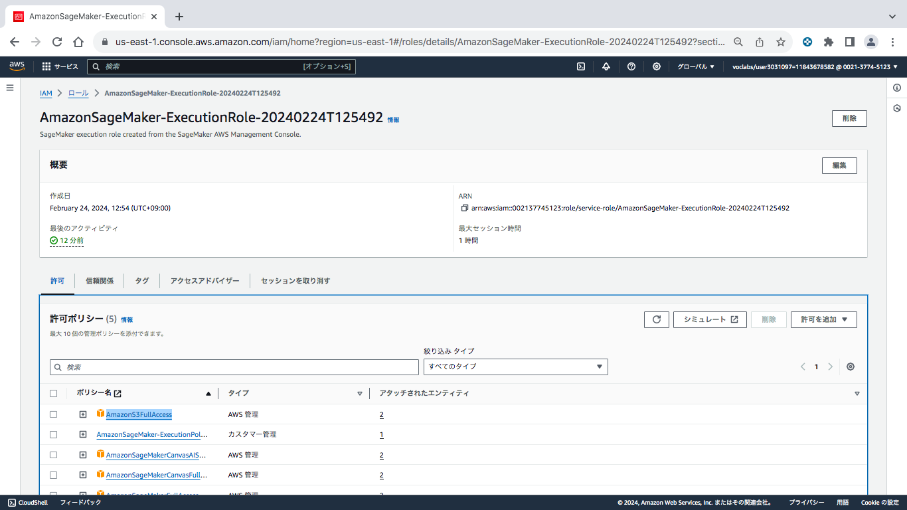

# Image Classification using AWS SageMaker

Use AWS Sagemaker to train a pretrained model that can perform image classification by using the Sagemaker profiling, debugger, hyperparameter tuning and other good ML engineering practices. This can be done on either the provided dog breed classication data set or one of your choice.

## Explanations of files
 - `train_and_deploy.ipynb` : main script in this project.
 - `scripts`
     - `hpo.py` - script for hyperparamete optimization.
     - `inference.py` : script for deploy and inference.
     - `train_model.py` : script for training model.

## Project Set Up and Installation
Enter AWS through the gateway in the course and open SageMaker Studio. 
Download the starter files.
Download/Make the dataset available. 

### Dataset
The provided dataset is the dogbreed classification dataset which can be found in the classroom.
The project is designed to be dataset independent so if there is a dataset that is more interesting or relevant to your work, you are welcome to use it to complete the project.


### Access
Upload the data to an S3 bucket through the AWS Gateway so that SageMaker has access to the data. 


## Hyperparameter Tuning

### Turning conditions
- Pre-Trained mdel : __Resnet18__, as it is low compute resources.

- Metric : __average test loss__

- Metric : Target paramerters and its range

    | Hyperparameter | Range |
    | ---- | ---- |
    | Learning rate | 0.001 ~ 0.1 |
    | Batch size | [32, 64, 128, 256, 512] |
    | Epochs | [2, 3, 4] |

### Results


- __Log metrics__ : 
    | Job No. | Hyperparameter | Metric |
    | ---- | ---- | ---- |
    | 1 | {'batch-size': 64, 'epochs': 4, 'lr': '0.029804049375637284'} | 0.054 |
    | 2 | {'batch-size': 256, 'epochs': 3, 'lr': '0.006105759237624362'} | 0.004 |
    | 3 | {'batch-size': 512, 'epochs': 4, 'lr': '0.011381231273161384'} | 0.002 |
    | 4 | {'batch-size': 512, 'epochs': 4, 'lr': '0.009181637917977842'} | 0.002 |

- __Best hyperparameters__ 

    {'batch-size': 512, 'epochs': 4, 'lr': '0.011381231273161384'}

## Debugging and Profiling

**TODO**: Give an overview of how you performed model debugging and profiling in Sagemaker

### Results
In summary, the profiling and debugging analysis of the training job revealed several key insights:

#### 1. Resource Utilization
- Both GPU and CPU utilization were relatively low, indicating potential underutilization of available resources.
- Instances of memory spikes were detected, suggesting potential inefficiencies in memory management.

#### 2. Training Efficiency:
- The batch size was identified as potentially too small, leading to underutilization of GPU resources.
- Insufficient dataloader workers impacted data preprocessing efficiency and contributed to GPU underutilization.

#### 3. Performance Bottlenecks:
- Consistently low GPU utilization was observed, indicating possible bottlenecks in the training process.
- However, CPU and I/O resources were adequately utilized without significant bottlenecks.

#### 4. Recommendations:
- Adjusting the batch size and increasing the number of dataloader workers were suggested to better utilize GPU resources and improve training efficiency.
- Consideration of switching to a smaller instance type and implementing memory management strategies to optimize resource usage.

In conclusion, the profiling and debugging analysis provided valuable insights into the training job's performance, highlighting areas for optimization to enhance efficiency and reduce resource waste.

The profiler html/pdf file is [here]().


## Model Deployment


### Deployed model

```
pytorch_model = PyTorchModel(
    model_data='s3://{}/{}/output/model.tar.gz'.format(bucket, estimator.latest_training_job.name), 
    role=role, 
    entry_point='scripts/inference.py',
    py_version="py36",
    framework_version="1.8",
    predictor_cls=ImagePredictor
)

predictor = pytorch_model.deploy(initial_instance_count=1, instance_type="ml.m5.large")
```

### How to query the endpoint

```
request_dict = { "url": "https://s3.amazonaws.com/cdn-origin-etr.akc.org/wp-content/uploads/2017/11/20113314/Carolina-Dog-standing-outdoors.jpg" }
response = predictor.predict(json.dumps(request_dict), initial_args={"ContentType": "application/json"})
```

### Insights from the model

(The model inferenced label "001" as label "001". The label "001" has 64 train data.)


(The model inferenced label "072" as label "072". The label "072" has 48 train data.)


(The model inferenced label "089" as label "042^". The label "089" has 53 train data.)


